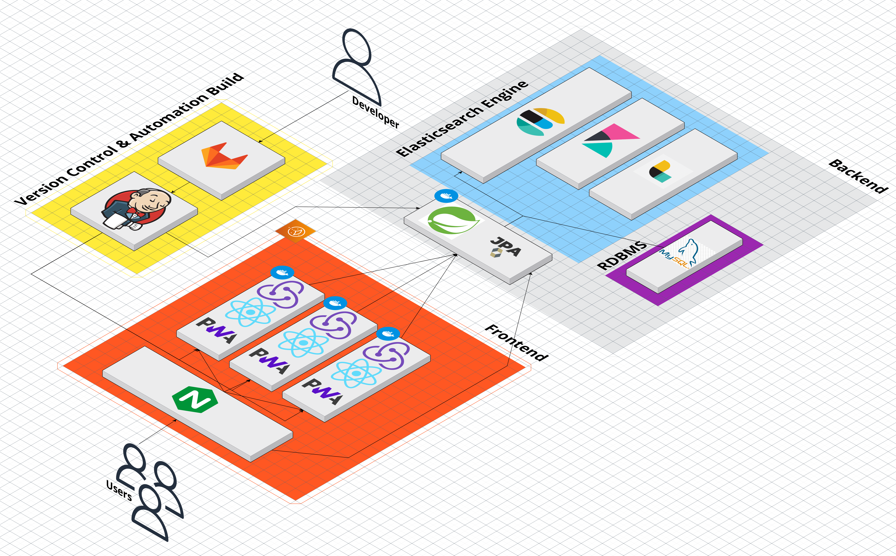

#  함께, 드림
### [함께, 드림]은 자립준비청년을 위한 맞춤형 복지 추천 및 관리 플랫폼입니다. 
💙 2022년 시설퇴소 청년 생활실태조사 보고서와 자립준비청년의 이해관계자들의 면담 및 실질적 요구사항을 담아 기획했습니다. 
<br>💙 자립 청년의 맞춤형 지원 사업 수혜율 100%로 될 때까지 모든 자립준비청년들의 독립을 응원합니다.                 
<br>


## **:sparkles: 목차**
 1. [개요](#1-개요) <br>2. [프로젝트 소개](#2-프로젝트-소개) <br> 3. [주요기능](#3-주요기능)
4. [기술스택](#4-기술스택)
   - [Front-End](#41-front-end)
   - [Back-End](#42-back-end)
5. [프로젝트 구조도](#5-프로젝트-구조도)
6. [아키텍쳐](#6-아키텍쳐)
7. [팀원](#7-팀원)

## 1. 개요 

:heavy_check_mark: 개발기간 : 2023.08.21 ~ 2023.10.06 <br>
:heavy_check_mark: 삼성 청년 소프트웨어 아카데미(SSAFY) 핀테크 프로젝트 <br>
:heavy_check_mark: 요구사항 분석: 광주자립전담기관 김평화 과장님 면담 & 자립청년들과의 이메일 & 화상 인터뷰 진행 <br>
:heavy_check_mark: 기획 배경: <br>

- - - - -
### <2022년 시설퇴소 청년 생활실태조사 보고서> 에 따르면 자립청년들은, <br>
:heavy_check_mark:  대략 70%의 대학 미진학 비율 <br>
:heavy_check_mark:  의식주의 어려움을 겪은 비율이 대략 30% 이상 <br>
:heavy_check_mark:  극단적인 생각을 한 경우 42.3% <br>
:heavy_check_mark:  부모나 친인척으로 부터 생활비를 받은 경험이 6.8% <br>
:heavy_check_mark:  어느곳에서도 지원을 받고 있지 않는 경우가 41.7% <br>

### 🔥 [경제적 어려움] 🔥 을 겪고 있는 상황
- - - - - - - - - - - - - - - - - - - - - - - - - - - - - - 

## 2. 프로젝트 소개

#  

<br> 

### 🔥 [데이터베이스 설계, ERD] 🔥 


## 3. 주요 기능 <br><br><br>😀[사용자 개인정보 등록]

      [회원 가입 Step 1, Step 2] 

- **`맞춤형 서비스를 지원받기 위해 사용자는 자신의 정보를 등록할 수 있다.`**
- **step 1 회원 가입을 시행한다.**
- **step 2 맞춤형 서비스를 위한 개인 정보를 등록할 수 있다.**

## 😀[맞춤형 복지 목록]

- **`맞춤형 자립 청년 지원 사업을 한눈에 볼 수 있다.`**
- **사용자 연령, 거주 지역, 보호 종료일 등에 따라 수혜 받을 수 있는 복지 카드 목록을 볼 수 있다.**
- **사용자는 상단에 자신이 심사 중인 지원 사업과 지원 받고 있는 사업에 대한 총 월 별 지원 금액을 볼 수 있다.**
- **사용자는 드래그를 통해 두 가지 항목으로 복지 카드를 이동 시킬 수 있다.**
- **복지 카드를 누르면 해당 복지의 정보를 볼 수 있다.**
- **복지 정보에는 복지 내용, 지원 금액, 지원 기간, 결과 발표일, 필요 서류, 대면 여부, 복지 사이트 링크를 볼 수 있다.**
- **복지 사이트 링크를 누르면 해당 링크로 이동한다.**
- **자신의 카드 상태를 변경 시킬 수 있다. (신청 제외, 이미 수혜 받은 혜택→ 카드 비활성)**

## 😀[자립 청년 챗봇]

- `**자립청년을 위한 금융 복지와 신청 안내 챗봇을 사용할 수 있다.**`
- **금융 복지 혜택을 보다 친근하게 접할 수 있습니다.**
- **자신에게 알맞은 금융 복지 정보 등을 챗봇과 대화를 통해 손쉽게 필요한 정보 얻고 이해할 수 있습니다.**
- **자립을 위한 금융 지원 정보를 알아보고 최적의 정보를 제공할 수 있습니다.**
- **응답 종류는 금융 복지 안내/ 개인화 추천/문의 응답 등이 있습니다.** <br>


## 😀[마이데이터 활용 - 알림]

- **`마이데이터 연결을 통해 확장된 맞춤형 서비스를 제공받을 수 있습니다.`**
- **사용자는 자신의 마이데이터 연결을 회원가입 시, 또는 마이페이지에서 연결 가능합니다.**
- **사용자는 자신의 거래 내역 데이터를 제공함으로써 수혜받고 있는 지원금을 자동으로 관리 가능합니다.**
- **사용자는 자신의 수혜 내역 총 금액에서 자신이 수혜받고 있는 계산된 지원금 총액을 알 수 있습니다.**
- **사용자는 직접 복지 카드를 등록, 해제 함으로써(드래그앤드랍) 정확도 높은 카드 관리가 가능합니다.**

## **😀[마이페이지]**

- **`마이페이지에서 나의 개인정보를 확인할 수 있다`**
- **사용자는 개인정보를 확인 할  수 있다.**
- **사용자는 개인정보를 수정할 수 있다.**
- **사용자는 마이페이지에서 마이데이터를 연결, 맞춤형 복지 지역 변경으로 재 추천받을 수 있습니다.**

## 4. 기술스택

### 4.1 Front-End 🌈


### 4.2 Back-End 📑


### 4.3 Infra 🏠


## 5. 프로젝트 구조도

```plaintext
📦frontend
 ┣ 📂build
 ┃ ┣ 📂static
 ┃ ┃ ┣ 📂css
 ┃ ┃ ┣ 📂js
 ┃ ┃ ┗ 📂media
 ┣ 📂public
 ┣ 📂src
 ┃ ┣ 📂api
 ┃ ┣ 📂assets
 ┃ ┃ ┣ 📂data
 ┃ ┃ ┣ 📂fonts
 ┃ ┃ ┗ 📂img
 ┃ ┣ 📂components
 ┃ ┃ ┣ 📂button
 ┃ ┃ ┣ 📂card
 ┃ ┃ ┣ 📂dropdown
 ┃ ┃ ┣ 📂header
 ┃ ┃ ┣ 📂input
 ┃ ┃ ┣ 📂loading
 ┃ ┃ ┣ 📂Logo
 ┃ ┃ ┣ 📂modal
 ┃ ┃ ┣ 📂mydata
 ┃ ┃ ┗ 📂Nav
 ┃ ┣ 📂router
 ┃ ┣ 📂store
 ┃ ┣ 📂style
 ┃ ┣ 📂views
 ┃ ┣ 📜App.css
 ┃ ┣ 📜App.js
 ┃ ┣ 📜index.css
 ┃ ┣ 📜index.js
 ┃ ┣ 📜service-worker.js
 ┃ ┗ 📜serviceWorkerRegistration.js
```

```
📦backend
 ┣ 📂.gradle
 ┃ ┣ 📂8.2.1
 ┃ ┃ ┣ 📂checksums
 ┃ ┃ ┃ ┣ 📜checksums.lock
 ┃ ┃ ┃ ┣ 📜md5-checksums.bin
 ┃ ┃ ┃ ┗ 📜sha1-checksums.bin
 ┃ ┃ ┣ 📂dependencies-accessors
 ┃ ┃ ┃ ┣ 📜dependencies-accessors.lock
 ┃ ┃ ┃ ┗ 📜gc.properties
 ┃ ┃ ┣ 📂executionHistory
 ┃ ┃ ┃ ┣ 📜executionHistory.bin
 ┃ ┃ ┃ ┗ 📜executionHistory.lock
 ┃ ┃ ┣ 📂fileChanges
 ┃ ┃ ┃ ┗ 📜last-build.bin
 ┃ ┃ ┣ 📂fileHashes
 ┃ ┃ ┃ ┣ 📜fileHashes.bin
 ┃ ┃ ┃ ┣ 📜fileHashes.lock
 ┃ ┃ ┃ ┗ 📜resourceHashesCache.bin
 ┃ ┃ ┗ 📜gc.properties
 ┃ ┣ 📂buildOutputCleanup
 ┃ ┃ ┣ 📜buildOutputCleanup.lock
 ┃ ┃ ┣ 📜cache.properties
 ┃ ┃ ┗ 📜outputFiles.bin
 ┃ ┣ 📂vcs-1
 ┃ ┃ ┗ 📜gc.properties
 ┃ ┗ 📜file-system.probe
 ┣ 📂.idea
 ┃ ┣ 📜.gitignore
 ┃ ┣ 📜compiler.xml
 ┃ ┣ 📜gradle.xml
 ┃ ┣ 📜jarRepositories.xml
 ┃ ┣ 📜misc.xml
 ┃ ┣ 📜uiDesigner.xml
 ┃ ┗ 📜vcs.xml
 ┣ 📂build
 ┃ ┣ 📂classes
 ┃ ┃ ┗ 📂java
 ┃ ┃ ┃ ┗ 📂main
 ┃ ┃ ┃ ┃ ┗ 📂com
 ┃ ┃ ┃ ┃ ┃ ┗ 📂youth
 ┃ ┃ ┃ ┃ ┃ ┃ ┗ 📂dream
 ┃ ┃ ┃ ┃ ┃ ┃ ┃ ┗ 📜DreamApplication.class
 ┃ ┣ 📂resources
 ┃ ┃ ┗ 📂main
 ┃ ┃ ┃ ┗ 📜application.properties
 ┃ ┗ 📂tmp
 ┃ ┃ ┗ 📂compileJava
 ┃ ┃ ┃ ┗ 📜previous-compilation-data.bin
 ┣ 📂dream
 ┃ ┣ 📂gradle
 ┃ ┃ ┗ 📂wrapper
 ┃ ┃ ┃ ┣ 📜gradle-wrapper.jar
 ┃ ┃ ┃ ┗ 📜gradle-wrapper.properties
 ┃ ┣ 📂src
 ┃ ┃ ┣ 📂main
 ┃ ┃ ┃ ┣ 📂java
 ┃ ┃ ┃ ┃ ┗ 📂com
 ┃ ┃ ┃ ┃ ┃ ┗ 📂youth
 ┃ ┃ ┃ ┃ ┃ ┃ ┗ 📂dream
 ┃ ┃ ┃ ┃ ┃ ┃ ┃ ┣ 📂controller
 ┃ ┃ ┃ ┃ ┃ ┃ ┃ ┃ ┣ 📂account
 ┃ ┃ ┃ ┃ ┃ ┃ ┃ ┃ ┃ ┗ 📜accountController.java
 ┃ ┃ ┃ ┃ ┃ ┃ ┃ ┃ ┣ 📂benefit
 ┃ ┃ ┃ ┃ ┃ ┃ ┃ ┃ ┃ ┗ 📜benefitController.java
 ┃ ┃ ┃ ┃ ┃ ┃ ┃ ┃ ┣ 📂transaction
 ┃ ┃ ┃ ┃ ┃ ┃ ┃ ┃ ┃ ┗ 📜transactionController.java
 ┃ ┃ ┃ ┃ ┃ ┃ ┃ ┃ ┣ 📂user
 ┃ ┃ ┃ ┃ ┃ ┃ ┃ ┃ ┃ ┗ 📜userController.java
 ┃ ┃ ┃ ┃ ┃ ┃ ┃ ┃ ┗ 📂welfare
 ┃ ┃ ┃ ┃ ┃ ┃ ┃ ┃ ┃ ┗ 📜welfareController.java
 ┃ ┃ ┃ ┃ ┃ ┃ ┃ ┣ 📂domain
 ┃ ┃ ┃ ┃ ┃ ┃ ┃ ┃ ┣ 📂account
 ┃ ┃ ┃ ┃ ┃ ┃ ┃ ┃ ┃ ┣ 📂repository
 ┃ ┃ ┃ ┃ ┃ ┃ ┃ ┃ ┃ ┃ ┗ 📜accountRepository.java
 ┃ ┃ ┃ ┃ ┃ ┃ ┃ ┃ ┃ ┗ 📜Account.java
 ┃ ┃ ┃ ┃ ┃ ┃ ┃ ┃ ┣ 📂benefit
 ┃ ┃ ┃ ┃ ┃ ┃ ┃ ┃ ┃ ┣ 📂repository
 ┃ ┃ ┃ ┃ ┃ ┃ ┃ ┃ ┃ ┃ ┗ 📜benefitRepository.java
 ┃ ┃ ┃ ┃ ┃ ┃ ┃ ┃ ┃ ┗ 📜Benefit.java
 ┃ ┃ ┃ ┃ ┃ ┃ ┃ ┃ ┣ 📂transaction
 ┃ ┃ ┃ ┃ ┃ ┃ ┃ ┃ ┃ ┣ 📂repository
 ┃ ┃ ┃ ┃ ┃ ┃ ┃ ┃ ┃ ┃ ┗ 📜transactionRepository.java
 ┃ ┃ ┃ ┃ ┃ ┃ ┃ ┃ ┃ ┗ 📜Transaction.java
 ┃ ┃ ┃ ┃ ┃ ┃ ┃ ┃ ┣ 📂user
 ┃ ┃ ┃ ┃ ┃ ┃ ┃ ┃ ┃ ┣ 📂repository
 ┃ ┃ ┃ ┃ ┃ ┃ ┃ ┃ ┃ ┃ ┗ 📜userRepository.java
 ┃ ┃ ┃ ┃ ┃ ┃ ┃ ┃ ┃ ┗ 📜User.java
 ┃ ┃ ┃ ┃ ┃ ┃ ┃ ┃ ┗ 📂welfare
 ┃ ┃ ┃ ┃ ┃ ┃ ┃ ┃ ┃ ┣ 📂repository
 ┃ ┃ ┃ ┃ ┃ ┃ ┃ ┃ ┃ ┃ ┗ 📜welfareRepository.java
 ┃ ┃ ┃ ┃ ┃ ┃ ┃ ┃ ┃ ┗ 📜Welfare.java
 ┃ ┃ ┃ ┃ ┃ ┃ ┃ ┣ 📂service
 ┃ ┃ ┃ ┃ ┃ ┃ ┃ ┃ ┣ 📂account
 ┃ ┃ ┃ ┃ ┃ ┃ ┃ ┃ ┃ ┣ 📂dto
 ┃ ┃ ┃ ┃ ┃ ┃ ┃ ┃ ┃ ┃ ┗ 📜accountDto.java
 ┃ ┃ ┃ ┃ ┃ ┃ ┃ ┃ ┃ ┗ 📜accountService.java
 ┃ ┃ ┃ ┃ ┃ ┃ ┃ ┃ ┣ 📂benefit
 ┃ ┃ ┃ ┃ ┃ ┃ ┃ ┃ ┃ ┣ 📂dto
 ┃ ┃ ┃ ┃ ┃ ┃ ┃ ┃ ┃ ┃ ┗ 📜benefitDto.java
 ┃ ┃ ┃ ┃ ┃ ┃ ┃ ┃ ┃ ┗ 📜benefitService.java
 ┃ ┃ ┃ ┃ ┃ ┃ ┃ ┃ ┣ 📂transaction
 ┃ ┃ ┃ ┃ ┃ ┃ ┃ ┃ ┃ ┣ 📂dto
 ┃ ┃ ┃ ┃ ┃ ┃ ┃ ┃ ┃ ┃ ┗ 📜transactionDto.java
 ┃ ┃ ┃ ┃ ┃ ┃ ┃ ┃ ┃ ┗ 📜transactionService.java
 ┃ ┃ ┃ ┃ ┃ ┃ ┃ ┃ ┣ 📂user
 ┃ ┃ ┃ ┃ ┃ ┃ ┃ ┃ ┃ ┣ 📂dto
 ┃ ┃ ┃ ┃ ┃ ┃ ┃ ┃ ┃ ┃ ┗ 📜userDto.java
 ┃ ┃ ┃ ┃ ┃ ┃ ┃ ┃ ┃ ┗ 📜userService.java
 ┃ ┃ ┃ ┃ ┃ ┃ ┃ ┃ ┗ 📂welfare
 ┃ ┃ ┃ ┃ ┃ ┃ ┃ ┃ ┃ ┣ 📂dto
 ┃ ┃ ┃ ┃ ┃ ┃ ┃ ┃ ┃ ┃ ┗ 📜welfareDto.java
 ┃ ┃ ┃ ┃ ┃ ┃ ┃ ┃ ┃ ┗ 📜welfareService.java
 ┃ ┃ ┃ ┃ ┃ ┃ ┃ ┗ 📜DreamApplication.java
 ┃ ┃ ┃ ┗ 📂resources
 ┃ ┃ ┃ ┃ ┗ 📜application.yml
 ┃ ┃ ┗ 📂test
 ┃ ┃ ┃ ┗ 📂java
 ┃ ┃ ┃ ┃ ┗ 📂com
 ┃ ┃ ┃ ┃ ┃ ┗ 📂youth
 ┃ ┃ ┃ ┃ ┃ ┃ ┗ 📂dream
 ┃ ┃ ┃ ┃ ┃ ┃ ┃ ┗ 📜DreamApplicationTests.java
 ┃ ┣ 📜.gitignore
 ┃ ┣ 📜build.gradle
 ┃ ┣ 📜gradlew
 ┃ ┣ 📜gradlew.bat
 ┃ ┗ 📜settings.gradle
 ┗ 📜HELP.md
```

## 6. 아키텍쳐



## 7. 팀원


| 신대혁 (팀장) | 김수진 | 김범규 | 이건호 |  홍주영 |
| --------------------------------------- | ------------------------------------- | --------------------------------------------- | -------------------- | ---------- | 
| |  | 큐티범규자리  | 귀염건호자리 | 섹시주영자리
| [shindaehyuk](https://github.com/shindaehyuk)  | [soo0300](https://github.com/soo0300)  | 범규자리찜 | 건호자리뀽  |  주영자리뿅 |
| Front-end             | Back-end                              | Front-end&Design                                     | Back-end&Infra| Front-end |
